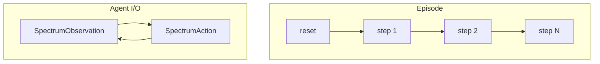
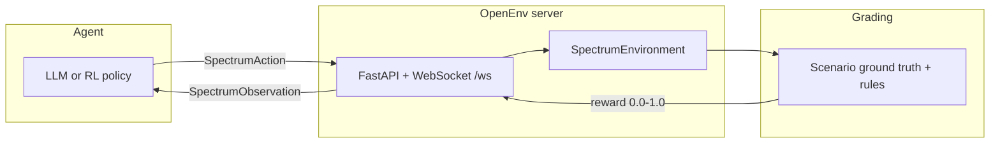

<div align="center">

# RF Spectrum Allocation Environment

**Train and evaluate AI agents on a real telecom workflow: who gets which frequency, at what power, under regulation.**


<br/>

[](LICENSE)
[](https://python.org)
[](https://github.com/meta-pytorch/OpenEnv)
[](Dockerfile)
[](server/app.py)

<br/>

| | |
|:---:|:---|
| **Domain** | RF spectrum allocation (operators & regulators) |
| **API** | `reset()` · `step(action)` · `state` (OpenEnv) |
| **Tasks** | **easy** (5) · **medium** (8) · **hard** (12) steps / episode |
| **Reward** | Dense, partial credit · per-step **0.0–1.0** |

<sub>OpenEnv manifest: [`openenv.yaml`](openenv.yaml) · Env name: `rf_spectrum_env`</sub>

</div>

---

## Navigate

| Section | What you’ll find |
|:--------|:-----------------|
| [Why this matters](#why-this-matters) | Real-world stakes and analogies |
| [How it works](#how-it-works) | Diagrams and one-minute mental model |
| [Spectrum & actors](#spectrum-grid--requesters) | Bands, powers, user types |
| [Agent interface](#action--observation-spaces) | `SpectrumAction` / `SpectrumObservation` |
| [Tasks & difficulty](#tasks) | Easy → Medium → Hard at a glance |
| [Rewards](#reward-function) | Weights, partial credit, penalties |
| [Run it](#quick-start) | Docker, local server, inference, client |
| [Hackathon checklist](#submission--validation-hints) | URLs, env vars, logs |

---

## Why this matters

Spectrum coordinators at operators (e.g. Jio, Airtel, AT&T, Vodafone) and regulators (DoT/TRAI, FCC, Ofcom) **approve or reject allocation requests** using occupancy, rules, and priority. This repo turns that into a **step-by-step environment** so LLMs and RL agents can be trained and compared fairly.

| If the coordinator… | Real-world impact |
|:--------------------|:------------------|
| Picks the wrong band / power | Interference, dropped calls and data |
| Blocks emergency traffic | First responders lose comms when it matters |
| Breaks policy | Fines, license risk, compliance failures |
| Under-uses spectrum | Congestion, worse 5G / IoT experience |

Industry push toward **dynamic spectrum access (DSA)** and automation makes this a **timely benchmark**, not a toy grid-world.

### Same pattern as other “real job” agent tasks

| Job pattern | Example domain | **Here** |
|:------------|:---------------|:---------|
| Read item → check policy → decide | Email triage | Request → rules → assign/reject |
| Read → verify constraints → act | Content moderation | Request → bands/power → decision |
| Read state → tool action → log | Support / IT | Grid + request → `SpectrumAction` |

---

## How it works

### Control loop (one episode = one “shift”)



### Architecture (OpenEnv + grader)



**Mental model:** each step is one **incoming allocation request**. The agent outputs **band index**, **power (dBm)**, and a **short justification**. The environment updates **occupancy**, applies **guard-band / priority** logic where relevant, and returns a **shaped reward** (not a single sparse win/loss at the end).

---

## Spectrum grid & requesters

### Spectrum grid

12 bands from **~700 MHz** to **~5.25 GHz**, with types matching protected / licensed / unlicensed / shared (CBRS-style) patterns.

| Band | Range (approx.) | Type | Max power | Real-world flavor |
|:---:|:---|:---|:---:|:---|
| **0** | 700 MHz | Protected | 30 dBm | Public safety / FirstNet-style |
| **1–2** | 700 MHz LTE | Licensed | 43 dBm | Macro LTE FDD |
| **3–4** | 850 MHz | Licensed | 40 dBm | Legacy cellular |
| **5–6** | ~1700 MHz (AWS-1) | Licensed | 38 dBm | Mid-band LTE / backhaul |
| **7–8** | 2.4 GHz ISM | Unlicensed | 20 dBm | Wi‑Fi / IoT |
| **9** | 3.5 GHz CBRS PAL | Shared | 30 dBm | Licensed shared / PAL |
| **10** | 3.6 GHz CBRS GAA | Shared | 23 dBm | General authorized access |
| **11** | 5 GHz UNII-1 | Unlicensed | 23 dBm | Wi‑Fi 5/6 low segment |

### Requesters (who is asking for spectrum)

| Type | Priority | What you should assume |
|:-----|:--------:|:-----------------------|
| Emergency | 1 | Must be served; protected / licensed; preemption themes |
| Military | 1 | Highest urgency scenarios in **hard** tasks |
| Commercial | 2–3 | Licensed bands; CBRS dynamics in medium/hard |
| IoT / smart city | 4–5 | Often unlicensed; **strict power** (e.g. 14 dBm caps in rules) |
| Amateur | 5 | Lowest priority; appropriate band types only |

---

## Action & observation spaces

### `SpectrumAction`

What the agent **does** each step (mirrors a human coordinator’s buttons / forms):

```python
class SpectrumAction(Action):
    assigned_band_index: int    # 0–11 assign, -1 = reject request
    assigned_power_dbm: float   # Transmit power (dBm)
    justification: str          # Short rationale (also used in reward keywords)
```

### `SpectrumObservation`

What the agent **sees** (dashboard-style state + the current ticket):

```python
class SpectrumObservation(Observation):
    spectrum_grid: List[Dict]       # Per-band occupancy / occupants
    active_allocations: List[Dict]  # Current users on air
    current_request: Dict           # The request being decided now
    regulatory_rules: List[str]     # Active rule text for this task
    task_difficulty: str            # "easy" | "medium" | "hard"
    step_number: int
    total_steps: int
    spectral_efficiency: float      # Utilization proxy
    episode_reward_so_far: float
    last_action_error: Optional[str]
    # plus OpenEnv fields: done, reward, metadata
```

---

## Tasks

| Task | Steps / episode | Vibe | What gets harder |
|:-----|:---------------:|:-----|:-----------------|
| **easy** | 5 | Quiet shift | Straightforward band + power fit |
| **medium** | 8 | Busy day | Priority, CBRS PAL vs GAA, redirects |
| **hard** | 12 | Crisis / congestion | Military, cognitive secondary, caps, adjacency |

<details>
<summary><b>Easy — Quiet shift (5 steps)</b></summary>

Mostly empty grid, clear band fits, fewer edge cases. Good for verifying the agent understands **band types** and **power limits**.

**Rough baseline (example LLM):** ~0.6–0.8 mean episode score.

</details>

<details>
<summary><b>Medium — Busy day (8 steps)</b></summary>

Adds **priority** and **shared spectrum** flavor: emergency vs commercial, PAL vs GAA, and more **guard-band** pressure in the narrative/rules.

**Rough baseline:** ~0.4–0.6.

</details>

<details>
<summary><b>Hard — Urban congestion (12 steps)</b></summary>

Stress case: **military / emergency**, **IoT over-power**, **cognitive / secondary** storylines, and **adjacent-band** tension. Rewards still dense per step, but the correct policy is much less obvious.

**Rough baseline:** ~0.2–0.4.

</details>

---

## Reward function

Rewards are **per step**, in **[0.0, 1.0]**, then averaged for an episode grade — so the agent gets **signal throughout the trajectory**, not only at the end.

### Weights (conceptual “audit scorecard”)

| Component | Weight | Plain language |
|:----------|:------:|:---------------|
| Band choice | **0.35** | Right band vs acceptable vs wrong type |
| Power | **0.25** | Within regulatory / scenario cap; partial credit near the edge |
| Priority / preemption story | **0.25** | Serve P1 correctly; don’t reject must-serve when allocation is expected |
| Justification | **0.15** | Mentions relevant keywords for the scenario (typed rubric) |

### Partial credit (examples)

| Situation | Band portion | Power portion (typical) |
|:----------|:-------------|:------------------------|
| Exact best band | 0.35 | Full if power OK |
| Acceptable alternate | 0.25 | Full if power OK |
| Right **category**, wrong channel | 0.10 | May still get partial power score |
| Bad type / violation | 0.00 | Often 0.00 + error string |

### Penalties (selected)

| Bad behavior | Effect |
|:-------------|:-------|
| Commercial into **protected** without eligibility | **−0.10** style penalty (clamped into [0,1] with the rest) |
| **Guard-band** clash vs active neighbor | **−0.05** |
| Reject **must-serve** emergency / military | Priority slice collapses (see code) |

Episode score: **`mean(step_rewards)`** via `grade_episode()` in [`server/spectrum_environment.py`](server/spectrum_environment.py).

---

## Quick start

### 1) Docker (matches HF-style deploy)

```bash
docker build -t rf-spectrum-env .
docker run -p 7860:7860 rf-spectrum-env
```

Smoke test:

```bash
curl http://localhost:7860/
curl http://localhost:7860/health
```

### 2) Local dev

```bash
git clone https://github.com/Ryan-gomezzz/rf_spectrum.git
cd rf_spectrum
pip install -e ".[dev]"
uvicorn server.app:app --host 0.0.0.0 --port 7860
```

### 3) Baseline LLM run (`inference.py`)

Requires **`HF_TOKEN`** (no default in code — export it in your shell or Space secrets).

```bash
set API_BASE_URL=https://router.huggingface.co/v1
set MODEL_NAME=meta-llama/Llama-3.1-8B-Instruct
set HF_TOKEN=your_token_here
python inference.py
```

Stdout uses the hackathon structured lines: **`[START]`**, **`[STEP]`**, **`[END]`** (see script header in [`inference.py`](inference.py)).

### 4) Python client (remote env)

```python
from rf_spectrum_env import SpectrumEnv, SpectrumAction

with SpectrumEnv(base_url="http://localhost:7860").sync() as env:
    result = env.reset()
    print(result.observation.task_difficulty, result.observation.current_request)
    result = env.step(SpectrumAction(
        assigned_band_index=1,
        assigned_power_dbm=35.0,
        justification="Licensed LTE band; power within regulatory cap.",
    ))
    print(result.reward, result.done)
```

---

## Submission & validation hints

| Check | Tip |
|:------|:----|
| **Space URL** | Use the **Space base** (e.g. `https://<user>-<space>.hf.space`) — not a pasted typo trail |
| **Health** | `GET /health` should be **200** |
| **Root** | `GET /` returns a small JSON index (see [`server/app.py`](server/app.py)) |
| **OpenEnv** | `openenv validate` from repo root |
| **Inference env** | `API_BASE_URL`, `MODEL_NAME`, **`HF_TOKEN`** required |

---

## Baseline scores (illustrative)

With **Llama-3.1-8B-Instruct**, HF router, **`temperature=0`**, fixed **scenario seed** in [`inference.py`](inference.py), expect roughly:

| Task | Episodes × steps | Typical mean |
|:-----|:----------------:|:------------:|
| easy | 3 × 5 | ~0.70 |
| medium | 3 × 8 | ~0.50 |
| hard | 3 × 12 | ~0.30 |

*(Exact numbers drift with provider routing and model updates — reproducibility is best-effort at the LLM layer.)*

---

## Repo layout

<details>
<summary><b>Click to expand tree</b></summary>

```
rf_spectrum_env/
├── openenv.yaml              # Task manifest (easy / medium / hard)
├── models.py                 # Pydantic Action / Observation / State
├── scenarios.py              # Deterministic scenarios + ground truth
├── client.py                 # WebSocket EnvClient
├── inference.py              # Baseline LLM agent + stdout protocol
├── Dockerfile                # Container entry (uvicorn server)
├── pyproject.toml
├── tests/test_environment.py
└── server/
    ├── app.py                # FastAPI app + GET /
    └── spectrum_environment.py
```

</details>

---

## Research angles

- **DSA / cognitive radio** — structured testbed beyond toy grids  
- **Regulatory reasoning** — rules-in-the-loop observations  
- **Priority & preemption** — safety-critical decision patterns  
- **LLM vs RL** — same env, different learners  

---

## License

BSD-3-Clause

---

<div align="center">

**Developed by Ryan Gomez, Renya Peter and Nysa Lakhotia**

</div>
