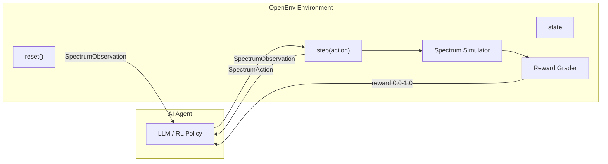

<div align="center">

# RF Spectrum Allocation Environment

**An OpenEnv environment that simulates the daily workflow of a telecom spectrum coordinator**


[](LICENSE)
[](https://python.org)
[](https://github.com/openenv)
[](Dockerfile)

*Train and evaluate AI agents on real-world radio frequency spectrum management — the same decisions made daily at telecom operators like Jio, Airtel, AT&T, and regulatory bodies like the FCC and TRAI.*

</div>

---

## Why This Task Matters

At every telecom operator and regulatory body worldwide, **spectrum coordinators** sit at dashboards processing allocation requests. Their job: read an incoming request, check current spectrum occupancy, consult regulatory rules, and make an assignment decision — or reject it with justification.

This is a high-stakes professional workflow with real consequences:

| Failure Mode | Impact |
|:-------------|:-------|
| Wrong assignment | Radio interference; dropped calls and data sessions for thousands of users |
| Delayed emergency allocation | First responders lose communication during disasters |
| Regulatory violation | Heavy fines and license revocations |
| Wasted spectrum | Degraded 5G performance and IoT failures |

As 5G densification and IoT proliferation (29B connected devices projected by 2030) increase demand, the industry is actively moving toward **AI-driven Dynamic Spectrum Access (DSA)**. This environment models the spectrum coordinator's decision-making workflow as a sequential task suitable for training and evaluating RL/LLM agents.

### Real-World Task Analogy

| Familiar Task | Workflow | This Environment |
|:--------------|:---------|:-----------------|
| Email triage | Read email &rarr; classify &rarr; route | Read request &rarr; classify &rarr; assign to band |
| Content moderation | Review content &rarr; check policy &rarr; approve/reject | Review request &rarr; check regulations &rarr; approve/reject |
| IT helpdesk | Check system status &rarr; diagnose &rarr; assign priority | Check band occupancy &rarr; assess interference &rarr; set priority |

---

## Architecture



The agent receives a **SpectrumObservation** (spectrum grid, incoming request, regulatory rules), produces a **SpectrumAction** (band assignment, power level, justification), and receives a **multi-component reward** scored against ground truth.

---

## Environment Details

### Spectrum Grid

12 frequency bands spanning 700 MHz to 5.25 GHz, modeled after real-world allocations:

| Band | Frequency Range | Type | Max Power | Real-World Analog |
|:-----|:---------------|:-----|:----------|:------------------|
| 0 | 700 MHz | **Protected** | 30 dBm | India: NDRF/SDRF; US: FirstNet |
| 1-2 | 700 MHz | Licensed | 43 dBm | Jio Band 5, Airtel FDD |
| 3-4 | 850 MHz | Licensed | 40 dBm | BSNL/MTNL legacy cellular |
| 5-6 | 1700 MHz (AWS-1) | Licensed | 38 dBm | Mid-band LTE backhaul |
| 7-8 | 2.4 GHz ISM | Unlicensed | 20 dBm | WiFi, Bluetooth, IoT |
| 9 | 3.5 GHz CBRS PAL | **Shared** | 30 dBm | US shared spectrum; India 5G n78 |
| 10 | 3.6 GHz CBRS GAA | **Shared** | 23 dBm | Secondary/opportunistic access |
| 11 | 5 GHz UNII-1 | Unlicensed | 23 dBm | WiFi 5/6, low-power devices |

### User Types (Requesters)

| Type | Priority | Behavior |
|:-----|:---------|:---------|
| Emergency services | 1 (highest) | Must be served immediately; can preempt others |
| Military | 1 (highest) | Can commandeer any non-emergency band |
| Commercial carriers | 2-3 | Jio, Airtel, Vodafone deploying base stations |
| IoT / smart city | 4-5 | Strict power limits (14 dBm in unlicensed bands) |
| Amateur radio | 5 (lowest) | Open bands only |

---

## Action Space

```python
class SpectrumAction(Action):
    assigned_band_index: int    # 0-11 to assign, -1 to reject
    assigned_power_dbm: float   # Transmit power in dBm
    justification: str          # Brief reasoning for the decision
```

This mirrors the real decision a spectrum coordinator makes: **which band**, at **what power**, and **why**.

## Observation Space

```python
class SpectrumObservation(Observation):
    spectrum_grid: List[Dict]        # All 12 bands with occupancy status
    active_allocations: List[Dict]   # Who is currently using what
    current_request: Dict            # The incoming allocation request
    regulatory_rules: List[str]      # Active regulatory constraints
    task_difficulty: str             # "easy" | "medium" | "hard"
    step_number: int                 # Current step in episode
    total_steps: int                 # Total requests this shift
    spectral_efficiency: float       # Current utilization ratio (0.0-1.0)
    episode_reward_so_far: float     # Cumulative performance
    last_action_error: str | None    # Feedback on previous decision
```

The observation provides everything a human coordinator would see on their dashboard: spectrum waterfall display, active users, the incoming request, and the regulatory rulebook.

---

## Tasks

### Easy — Quiet Shift (5 requests/episode)

A low-traffic period. Spectrum is mostly empty, requests clearly match available bands. A commercial carrier wants LTE spectrum — Band 1 is free. An IoT sensor wants ISM band — Band 7 is open. No conflicts, no ambiguity.

**Tests:** Basic band-type comprehension, power limits, request-to-band matching.

**Expected baseline:** 0.6 - 0.8

### Medium — Busy Day with Priority Conflicts (8 requests/episode)

Peak hours with competing requests:
- Emergency dispatch requiring the protected band
- Commercial carrier requesting protected spectrum (must be redirected)
- CBRS shared spectrum with PAL/GAA priority dynamics
- Adjacent-band situations requiring guard band awareness

**Tests:** Regulatory awareness, priority handling, redirection logic.

**Expected baseline:** 0.4 - 0.6

### Hard — Crisis Scenario: Urban Spectrum Congestion (12 requests/episode)

A disaster or major event with cascading pressures:
- Military commandeering active bands for secure operations
- Multiple competing emergency requests for the same protected spectrum
- IoT devices requesting excessive power (must be capped at 14 dBm)
- Cognitive radio secondary users that must sense and avoid primary users
- High-power adjacent-band deployments causing aggregate interference

**Tests:** Preemption logic, power regulation enforcement, cognitive radio DSA reasoning, graceful degradation under congestion.

**Expected baseline:** 0.2 - 0.4

---

## Reward Function

Each step is scored across four dimensions that map to real performance metrics used in telecom spectrum audits:

| Component | Weight | What It Measures |
|:----------|:-------|:-----------------|
| Band selection | 0.35 | Did the coordinator assign the right type of spectrum? |
| Power compliance | 0.25 | Is the assigned power within regulatory limits? |
| Priority handling | 0.25 | Were emergency/military requests served first? Preemptions handled? |
| Justification quality | 0.15 | Does the reasoning mention relevant factors? |

### Partial Credit Design

The reward is **not binary** — it provides granular feedback:

| Scenario | Reward |
|:---------|:-------|
| Optimal band assigned | 0.35 / 0.35 |
| Acceptable but non-optimal band | 0.25 / 0.35 |
| Right band type, wrong specific band | 0.10 / 0.35 |
| Wrong band type entirely | 0.00 / 0.35 |
| Power within limits | 0.25 / 0.25 |
| Power slightly over (<=3 dB) | 0.15 / 0.25 |
| Power way over (>10 dB) | 0.00 / 0.25 |

### Penalties

| Violation | Penalty |
|:----------|:--------|
| Non-emergency user in protected band | -0.10 |
| Guard band violation (insufficient adjacent separation) | -0.05 |
| Rejecting emergency/military request | 0.00 for priority component |

**Episode score** = mean of per-step rewards, clamped to **[0.0, 1.0]**.

---

## Quick Start

### Docker (Recommended)

```bash
docker build -t rf-spectrum-env .
docker run -p 7860:7860 rf-spectrum-env
```

The environment will be available at `http://localhost:7860`. Verify with:

```bash
curl http://localhost:7860/health
```

### Local Development

```bash
# Clone and install
git clone <repo-url>
cd rf_spectrum_env
pip install -e ".[dev]"

# Run the server
uvicorn server.app:app --host 0.0.0.0 --port 7860
```

### Running Inference

```bash
API_BASE_URL=https://router.huggingface.co/v1 \
MODEL_NAME=meta-llama/Llama-3.1-8B-Instruct \
HF_TOKEN=your_token \
python inference.py
```

The inference script runs all three tasks (easy, medium, hard) with 3 episodes each and emits structured `[START]`/`[STEP]`/`[END]` logs to stdout.

### Client Usage

```python
from rf_spectrum_env import SpectrumEnv, SpectrumAction

with SpectrumEnv(base_url="http://localhost:7860").sync() as env:
    result = env.reset()
    print(f"Task: {result.observation.task_difficulty}")
    print(f"Request: {result.observation.current_request}")

    result = env.step(SpectrumAction(
        assigned_band_index=1,
        assigned_power_dbm=35.0,
        justification="Commercial LTE request routed to licensed Band 1."
    ))
    print(f"Reward: {result.reward}")
```

---

## Baseline Scores

Produced with **Llama-3.1-8B-Instruct** via Hugging Face Inference API (`temperature=0.0`, `seed=42`):

| Task | Episodes | Mean Score | Min | Max |
|:-----|:---------|:----------|:----|:----|
| Easy | 3 | ~0.70 | 0.60 | 0.80 |
| Medium | 3 | ~0.50 | 0.40 | 0.60 |
| Hard | 3 | ~0.30 | 0.20 | 0.40 |

---

## Environment Variables

| Variable | Required | Description |
|:---------|:---------|:------------|
| `API_BASE_URL` | Yes | LLM API endpoint |
| `MODEL_NAME` | Yes | Model identifier for inference |
| `HF_TOKEN` | Yes | Hugging Face API key (also accepts `OPENAI_API_KEY`) |

---

## File Structure

```
rf_spectrum_env/
├── __init__.py                  # Package exports
├── models.py                    # Typed Pydantic models (Action, Observation, State)
├── scenarios.py                 # Deterministic scenario generator (easy/medium/hard)
├── client.py                    # WebSocket-based EnvClient
├── inference.py                 # Baseline inference script with structured logging
├── openenv.yaml                 # OpenEnv manifest (3 tasks)
├── pyproject.toml               # Package configuration
├── Dockerfile                   # Production container (serves environment)
├── README.md                    # This file
├── tests/
│   └── test_environment.py      # Comprehensive unit tests
└── server/
    ├── __init__.py
    ├── app.py                   # FastAPI application via create_fastapi_app
    ├── spectrum_environment.py  # Core environment logic + reward grader
    ├── requirements.txt
    └── Dockerfile               # Alternative server-only container
```

---

## Research Applications

This environment directly serves as a training ground for:

- **Cognitive radio DSA algorithms** — deep RL approaches (DQN, PPO) for spectrum sensing and dynamic reallocation
- **Multi-agent spectrum sharing** — scenarios where multiple operators manage overlapping geographic regions
- **Regulatory compliance verification** — testing whether AI agents correctly interpret and apply complex telecom rule sets
- **Emergency spectrum management** — priority-aware allocation under crisis conditions
- **5G/6G network automation** — as part of the broader O-RAN intelligent controller (RIC) ecosystem

---

## License

BSD-3-Clause
